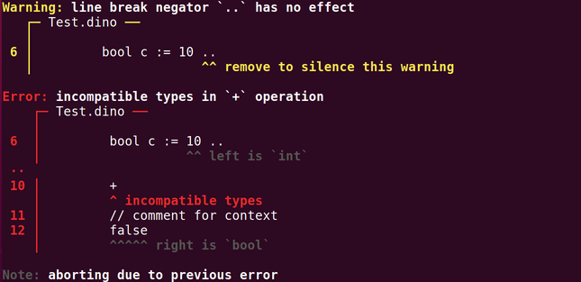

# Error Reporter

A simple implementation for pretty error diagnostics. Used for the Dino compiler.



### Example

```c++
auto file = new SourceFile("Main.cpp");
auto file2 = new SourceFile("ErrorReporter.cpp");
reporter::report(
    reporter::Error(
        "a complex error",
        "this is where the error is, hence the bold red",
        ERROR,
        { 4, 9, 13, file }
    )
    
    .withNote("a relevant include", { 1, 0, 8, file })
    .withNote("curly brace!", { 3, 0, 1, file })
    .withNote("a type", { 4, 4, 8, file })
    .withNote("assignment", { 4, 14, 15, file })
    .withNote("a variable with a very long explanation\n"
              "which requires an especially\n"
              "large number of lines", { 4, 9, 13, file })
    .withHelp("a help message", { 4, 31, 41, file })
    .withNote("relevant include in another file\n"
              "with another line\n"
              "and another", {1, 0, 8, file2})
    .withHelp("something important", {5, 4, 25, file2})

    .withHelp("a general help message,\nnot set to any specific position")
    .withNote("can also be a note")
);
```
