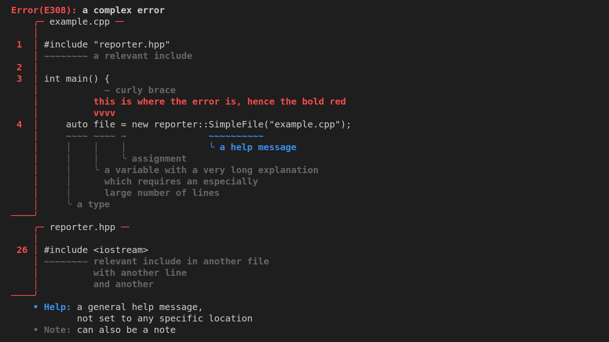

# Diagnostic Reporter

A simple implementation for pretty, Rust-style error diagnostics.

Used for the Dino compiler.



## Example

```c++
auto file = new reporter::SimpleFile("example.cpp");
auto file2 = new reporter::SimpleFile("reporter.hpp");
auto err = reporter::Error(
        "a complex error",
        "this is where the error is, hence the bold red",
        "E308",
        { 4, 9, 13, file }
    )
    .withNote("a relevant include", { 1, 0, 8, file })
    .withNote("curly brace", { 3, 11, 12, file })
    .withNote("a type", { 4, 4, 8, file })
    .withNote("assignment", { 4, 14, 15, file })
    .withNote("a variable with a very long explanation\n"
              "which requires an especially\n"
              "large number of lines", { 4, 9, 13, file })
    .withHelp("a help message", { 4, 30, 40, file })

    .withNote("relevant include in another file\n"
              "with another line\nand another", {26, 0, 8, file2})
    
    .withHelp("a general help message,\nnot set to any specific location")
    .withNote("can also be a note");

err.print(std::cerr);
```

## Adding to Your Project

Simply copy `reporter.hpp` somewhere into to your project's directories.


## How to Use

### Simple Usage

```c++
auto err = reporter::Error(
        "an error", "with a submessage", 
        {3, 4, 6, new reporter::SimpleFile("example.cpp") }
    )
    .withNote("and a note");

err.print(std::cerr);
```

### Diagnostic Types

```c++
auto err    = reporter::Error("an error");
auto warn   = reporter::Warning("a warning");
auto note   = reporter::Note("a note");
auto help   = reporter::Help("some help");
auto intern = reporter::InternalError("an internal compiler error");
```

The only major differences between the types are their names and their color.

### Locations

```c++
auto file = new reporter::SimpleFile("example.cpp");
reporter::Location loc { 
    2, // at line 2
    3, // from the 4th character
    8, // to (and excluding) the 9th character
    file // in example.cpp
};
```

You can also exclude `end` to simply get a location pointing at one specific character:

```c++
reporter::Location loc { 1, 4, file };
```

### Notes/Help

```c++
reporter::SimpleFile file("example.cpp");
reporter::Error("an error", { 2, 3, 5, &file })
    .withNote("a note with a location", { 2, 7, 10, &file })
    .withNote("a note without a location")
    .withHelp("help with a location", { 2, 2, &file })
    .withHelp("help without a location");
    .print(std::cerr);
```